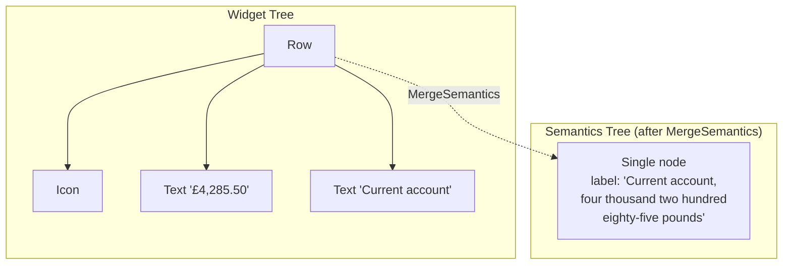

import Tabs from '@theme/Tabs';
import TabItem from '@theme/TabItem';

## Section 4: MergeSemantics — One Card, One Announcement



Without `MergeSemantics`, a screen reader visits each child of a widget separately. On the Account Overview, that means: icon → account name → balance → three more elements. Six focus stops per account card. Exhausting.

<div className="ab-step">
  <div className="ab-step__badge">1</div>
  <div className="ab-step__content">

`MergeSemantics` combines all descendant semantics nodes into a single node. When used together with a `Semantics` label, it creates one clean announcement for the entire card — and prevents the screen reader from diving into child elements separately.

  </div>
</div>

<Tabs>
  <TabItem value="before" label="Before — 6 focus stops per card" default>

```dart title="lib/screens/account_overview/widgets/account_card.dart"
// Screen reader visits each element separately:
// 1. Icon: "Image"
// 2. Account name: "Everyday Checking"
// 3. Balance: "4285.50"
// = 3 focus stops just to understand one account card
Row(
  children: [
    Icon(Icons.account_balance_wallet_outlined),
    Column(
      children: [
        Text('Everyday Checking'),
        Text('\£4,285.50'),
      ],
    ),
  ],
)
```

  </TabItem>
  <TabItem value="after" label="After — 1 focus stop per card">

```dart title="lib/screens/account_overview/widgets/account_card.dart"
// Screen reader announces the whole card as one unit:
// "Everyday Checking, checking account,
//  balance four thousand two hundred eighty-five pounds and fifty pence"
MergeSemantics(
  child: Semantics(
    label: spokenLabel, // The complete spoken description
    child: Row(
      children: [
        Icon(Icons.account_balance_wallet_outlined),
        Column(
          children: [
            Text('Everyday Checking'),
            Text('\£4,285.50'),
          ],
        ),
      ],
    ),
  ),
)
```

  </TabItem>
</Tabs>

<div className="ab-callout ab-callout--amber">
  <div className="ab-callout__header">Why this matters</div>
  <p>On the Account Overview screen with three account cards, that's the difference between 9+ focus stops versus 3. Screen reader users navigate linearly — every unnecessary stop adds cognitive load and time. The fewer stops required to understand a screen, the better.</p>
</div>

---

## Section 5: ExcludeSemantics — Silencing the Noise

`ExcludeSemantics` hides a widget subtree from the semantics tree entirely. Decorative elements that add visual interest but carry no information should be invisible to screen readers.

<div className="ab-step">
  <div className="ab-step__badge">1</div>
  <div className="ab-step__content">

The account card icon (`Icons.account_balance_wallet_outlined`) is a good example. Its meaning — "this is a bank account" — is already covered by the `label` on the `Semantics` wrapper. Without `ExcludeSemantics`, VoiceOver might announce it separately as "Image", creating redundant noise.

  </div>
</div>

<Tabs>
  <TabItem value="before" label="Before — decorative icon is announced" default>

```dart title="lib/screens/account_overview/widgets/account_card.dart"
// The icon gets its own semantics announcement: "Image"
// This is redundant — the label already describes the account type.
Icon(
  Icons.account_balance_wallet_outlined,
  color: inaccessible.lightBlueOnWhite,
  size: 32,
)
```

  </TabItem>
  <TabItem value="after" label="After — decorative icon is silenced">

```dart title="lib/screens/account_overview/widgets/account_card.dart"
// The icon is completely invisible to screen readers.
// Its meaning is conveyed by the parent Semantics label instead.
ExcludeSemantics(
  child: Icon(
    _iconForType(account.type),
    color: AppColors.primary, // Also fixed the contrast!
    size: 32,
  ),
)
```

  </TabItem>
</Tabs>

<div className="ab-callout ab-callout--blue">
  <div className="ab-callout__header">💡 When to use ExcludeSemantics</div>
  <p>Use it for: background patterns, separator lines, decorative repeated icons, visual flourishes. Do NOT use it on anything that carries meaning not conveyed elsewhere — that would hide information from screen reader users.</p>
</div>

---

## Section 6: Hear the Difference

<div className="ab-step">
  <div className="ab-step__badge">1</div>
  <div className="ab-step__content">

Use the toggle at the top of the tutorial panel to switch between the "Before" and "After" versions of the Account Overview screen.

Enable your screen reader and swipe through both versions. The "after" version should feel dramatically more coherent — each account announces as a single meaningful unit, the quick-action buttons are self-documenting, and the decorative noise is gone.

  </div>
</div>

<div className="ab-callout ab-callout--blue">
  <div className="ab-callout__header">💡 Try it yourself</div>
  <p>Toggle between the accessible and original versions with your screen reader active. Count how many swipes you need to understand the account information in each version. What's the difference?</p>
</div>

<div className="ab-callout ab-callout--green">
  <div className="ab-callout__header">✓ Checkpoint</div>
  <p>In the accessible version, navigating the entire Account Overview should require: one swipe per account card (not six), four clearly labelled quick-action buttons, and no "Image" or "Button" announcements. If you're still hearing those, check that <code>MergeSemantics</code> is wrapping the card and <code>ExcludeSemantics</code> is wrapping the icon.</p>
</div>

---

## Deep Dive

- [Semantics class — Flutter API documentation](https://api.flutter.dev/flutter/widgets/Semantics-class.html)
- [MergeSemantics — Flutter API documentation](https://api.flutter.dev/flutter/widgets/MergeSemantics-class.html)
- [ExcludeSemantics — Flutter API documentation](https://api.flutter.dev/flutter/widgets/ExcludeSemantics-class.html)
- [WCAG 1.1.1 — Non-text Content](https://www.w3.org/WAI/WCAG21/Understanding/non-text-content.html)
- [WCAG 4.1.2 — Name, Role, Value](https://www.w3.org/WAI/WCAG21/Understanding/name-role-value.html)

---

## What's Next

The Account Overview now speaks clearly. But speaking clearly is only half the problem — users also need to be able to *navigate* to what they want efficiently. In **Chapter 3: Finding Your Way**, you'll fix the Login screen's broken focus order, trap focus properly inside modal dialogs, and add skip navigation for keyboard users.
