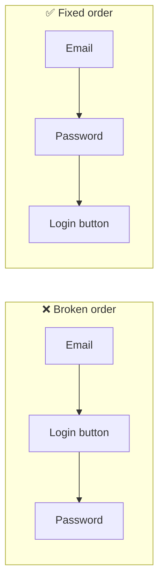

import Tabs from '@theme/Tabs';
import TabItem from '@theme/TabItem';

# Finding Your Way

> *"I never thought about Tab order before."*

**Estimated time:** ~20 minutes | **Focus:** Login + Dialogs | **Branch:** `chapter-3-navigation`

---

Broken focus order is one of the most disorienting accessibility failures. Imagine trying to fill in a login form while focus jumps unpredictably from the email field to a button in the corner and back again — with no visual cues, guided only by audio. That's the reality for screen reader users navigating AccessBank's Login screen right now.

In this chapter you'll fix it.

---

## Section 1: What is Focus Order?



<div className="ab-step">
  <div className="ab-step__badge">1</div>
  <div className="ab-step__content">

When a screen reader user swipes right to navigate forward, they're moving through the **focus order** — the sequence in which elements receive keyboard/screen reader focus. By default, Flutter traverses widgets in the order they appear in the widget tree (roughly top-to-bottom, left-to-right), which usually works well.

"Usually" is the problem.

  </div>
</div>

<div className="ab-step">
  <div className="ab-step__badge">2</div>
  <div className="ab-step__content">

On the AccessBank Login screen, the floating action button (the help button) was placed early in the widget tree for z-order rendering reasons. So the focus order becomes:

**FAB → Email field → Password field → Sign In button**

Instead of the logical:

**Email field → Password field → Sign In button → FAB**

A screen reader user trying to sign in is immediately confronted with a help button before they've even reached the email field. Deeply confusing.

  </div>
</div>

---

## Section 2: Fix the Tab Order with FocusTraversalGroup

<div className="ab-step">
  <div className="ab-step__badge">1</div>
  <div className="ab-step__content">

`FocusTraversalGroup` lets you define an independent traversal group. Widgets inside the group are ordered relative to each other, and the group as a whole is positioned in the parent traversal sequence. Wrapping `LoginForm` in a group means the form fields are all visited before focus moves to the FAB.

  </div>
</div>

<Tabs>
  <TabItem value="before" label="Before — FAB jumps first" default>

```dart title="lib/screens/login/login_screen.dart"
// Focus order: FAB → Email → Password → Sign In
// Because the FAB appears early in the widget tree
Scaffold(
  body: LoginForm(),
  floatingActionButton: HelpFab(),
)
```

  </TabItem>
  <TabItem value="after" label="After — form is fully traversed first">

```dart title="lib/screens/login/login_screen.dart"
// Focus order: Email → Password → Sign In → FAB
// FocusTraversalGroup ensures the form is traversed before the FAB
Scaffold(
  body: FocusTraversalGroup(
    policy: ReadingOrderTraversalPolicy(),
    child: LoginForm(),
  ),
  floatingActionButton: HelpFab(),
)
```

  </TabItem>
</Tabs>

<div className="ab-callout ab-callout--amber">
  <div className="ab-callout__header">Why this matters</div>
  <p>Focus order should match reading order — the sequence a sighted user would naturally read the screen. When it doesn't, screen reader users experience a kind of spatial disorientation: they know roughly where they are, but the navigation jumps don't match their mental model of the screen.</p>
</div>

---

## Section 3: Custom Traversal Order with FocusTraversalOrder

Sometimes `ReadingOrderTraversalPolicy` still gets it wrong — especially with complex or non-linear layouts. `FocusTraversalOrder` with `OrderedTraversalPolicy` lets you set an explicit numeric sequence on individual widgets.

<div className="ab-step">
  <div className="ab-step__badge">1</div>
  <div className="ab-step__content">

The Login form should flow: **Email (1) → Password (2) → Sign In (3) → Biometric (4)**. That's what `NumericFocusOrder` enforces. Notice that in the real code, each field also has its own `FocusNode`, so pressing the Return key on the email field moves focus to the password field programmatically.

  </div>
</div>

<Tabs>
  <TabItem value="before" label="Before — inaccessible form" default>

```dart title="lib/screens/login/widgets/login_form.dart"
// Inaccessible version: hint text only, no persistent labels,
// no focus management, vague button text, tiny touch targets.
Column(
  crossAxisAlignment: CrossAxisAlignment.stretch,
  children: [
    // hintText vanishes when the field is focused — confusing!
    TextField(
      controller: _emailController,
      decoration: const InputDecoration(
        hintText: 'Email',
        border: OutlineInputBorder(),
      ),
    ),
    const SizedBox(height: 12),
    TextField(
      controller: _passwordController,
      decoration: const InputDecoration(
        hintText: 'Password',
        border: OutlineInputBorder(),
      ),
      obscureText: true,
    ),
    const SizedBox(height: 16),
    // "Go" tells screen reader users nothing about this button's purpose
    FilledButton(
      onPressed: _submit,
      child: const Text('Go'),
    ),
    const SizedBox(height: 8),
    // Tiny 32x32 touch target — below WCAG 44x44pt minimum
    Center(
      child: SizedBox(
        width: 32,
        height: 32,
        child: IconButton(
          padding: EdgeInsets.zero,
          iconSize: 20,
          icon: const Icon(Icons.fingerprint),
          onPressed: widget.onSubmit,
          // No tooltip, no semantics label
        ),
      ),
    ),
  ],
)
```

  </TabItem>
  <TabItem value="after" label="After — accessible form">

```dart title="lib/screens/login/widgets/login_form.dart"
// Accessible version: persistent labels, explicit focus order,
// descriptive button text, 48x48 touch targets throughout.
FocusTraversalGroup(
  policy: OrderedTraversalPolicy(),
  child: Column(
    crossAxisAlignment: CrossAxisAlignment.stretch,
    children: [
      // labelText is persistent — stays visible when field is focused
      FocusTraversalOrder(
        order: const NumericFocusOrder(1),
        child: TextField(
          controller: _emailController,
          focusNode: _emailFocusNode,
          decoration: const InputDecoration(
            labelText: 'Email',
            hintText: 'you@example.com',
            border: OutlineInputBorder(),
          ),
          keyboardType: TextInputType.emailAddress,
          autofillHints: const [AutofillHints.email],
          textInputAction: TextInputAction.next,
          onSubmitted: (_) => _passwordFocusNode.requestFocus(),
        ),
      ),
      const SizedBox(height: 12),
      FocusTraversalOrder(
        order: const NumericFocusOrder(2),
        child: TextField(
          controller: _passwordController,
          focusNode: _passwordFocusNode,
          decoration: const InputDecoration(
            labelText: 'Password',
            border: OutlineInputBorder(),
          ),
          obscureText: true,
          autofillHints: const [AutofillHints.password],
          textInputAction: TextInputAction.done,
          onSubmitted: (_) => _submit(),
        ),
      ),
      const SizedBox(height: 16),
      // "Sign In" is clear and descriptive
      FocusTraversalOrder(
        order: const NumericFocusOrder(3),
        child: SizedBox(
          height: 48, // 48x48 minimum touch target
          child: FilledButton(
            focusNode: _signInFocusNode,
            onPressed: _submit,
            child: const Text('Sign In'),
          ),
        ),
      ),
      const SizedBox(height: 8),
      // 48x48 touch target + full semantics label and hint
      Center(
        child: FocusTraversalOrder(
          order: const NumericFocusOrder(4),
          child: Semantics(
            label: 'Sign in with biometrics',
            hint: 'Double tap to sign in using fingerprint or face ID',
            button: true,
            child: SizedBox(
              width: 48,
              height: 48,
              child: Tooltip(
                message: 'Sign in with biometrics',
                child: IconButton(
                  focusNode: _biometricFocusNode,
                  padding: EdgeInsets.zero,
                  iconSize: 28,
                  icon: const Icon(Icons.fingerprint),
                  onPressed: widget.onSubmit,
                ),
              ),
            ),
          ),
        ),
      ),
    ],
  ),
)
```

  </TabItem>
</Tabs>

<div className="ab-callout ab-callout--blue">
  <div className="ab-callout__header">💡 Try it yourself</div>
  <p>Enable your screen reader and navigate through the Login form in both the "before" and "after" versions. In the "before" version, listen for when the biometric button is announced — it's before the email field. In the "after" version, the flow should feel completely natural: email, password, sign in, biometrics.</p>
</div>

---
