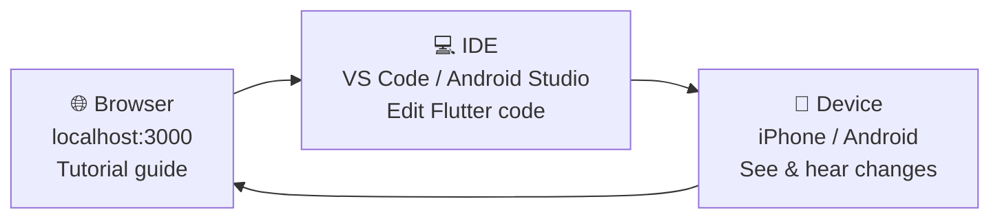
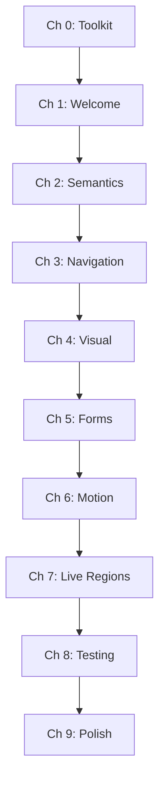

# Welcome to AccessBank

Learn Flutter accessibility by building a real banking app — one chapter at a time.

## What You'll Build

AccessBank is a Flutter banking app with realistic screens: login, dashboard, transfer money, transaction history, and account settings. It works — but it's inaccessible. Your job is to fix it.

By the end, every screen will be fully usable with VoiceOver and TalkBack. You will have written real semantic widget trees, tested with actual screen readers, and shipped accessible Flutter code you're proud of.

## What You'll Learn

- Setting up accessibility tooling in Flutter (DevTools, screen readers, inspector)
- Writing semantic widget trees with `Semantics`, `MergeSemantics`, and `ExcludeSemantics`
- Navigation and focus management for screen readers and keyboard users
- Visual accessibility: contrast ratios, text scaling, touch targets, and dark mode
- Accessible forms: labels, error announcements, validation, and autofill
- Reducing motion for users with vestibular disorders
- Live regions and dynamic announcements
- Testing with TalkBack, VoiceOver, and Flutter's accessibility widget test matchers
- Polishing for production across iOS and Android

## How This Tutorial Works

This tutorial uses a **three-panel workflow**:



Read the guide in your browser, make code changes in your IDE, and immediately hear the result on your connected device with a screen reader running.

## Chapter Learning Path



## Chapter Branches

Every chapter has a matching git branch that contains AccessBank exactly as it should look after completing that chapter. The branches build incrementally — `chapter-1-setup` has the unmodified starter app with issues identified, `chapter-2-semantics` adds semantic labels, `chapter-5-forms` adds accessible form handling, and so on up to `chapter-9-polish` which is the fully accessible app.

Use them to check your work, catch up if you fall behind, or skip ahead:

```bash
# See the finished code for any chapter
git checkout chapter-2-semantics

# Compare your work against the solution
git diff chapter-2-semantics -- lib/

# Go back to where you were
git checkout main
```

:::tip
You don't need to use the branches at all if you're following along and writing the code yourself — they're a safety net, not a requirement.
:::

## Prerequisites

- Flutter SDK 3.x+ — [Install Flutter](https://docs.flutter.dev/get-started/install)
- Node.js 18+ — [nodejs.org](https://nodejs.org)
- VS Code or Android Studio
- An iOS device/simulator or Android device/emulator
- Basic Flutter knowledge (built at least one app)
- No accessibility experience needed!

## Ready to Start?

Run `./setup.sh` to install all dependencies and configure iOS signing, then `./start.sh` to launch the tutorial guide and app together. Then jump straight in:

[Start Chapter 0: Your Accessibility Toolkit](/chapters/toolkit)
