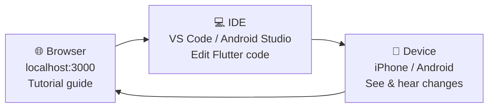
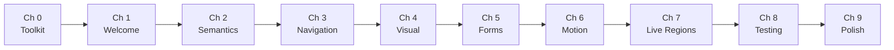
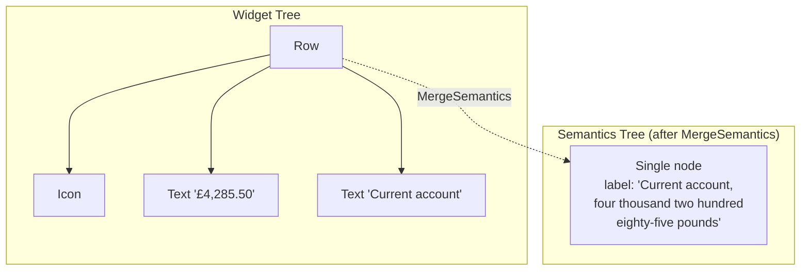
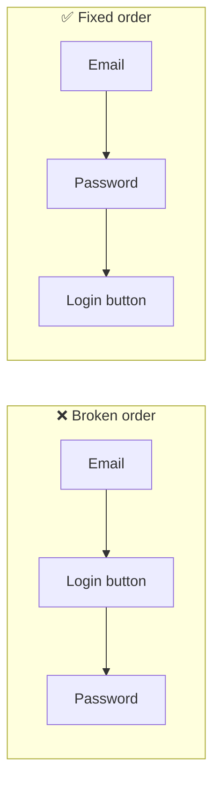

# Interactive Tutorial Features — Implementation Plan

> **For agentic workers:** REQUIRED SUB-SKILL: Use `superpowers:subagent-driven-development` (recommended) or `superpowers:executing-plans` to implement this plan task-by-task. Steps use checkbox (`- [ ]`) syntax for tracking.

**Goal:** Add interactive quizzes, chapter sub-pages, progress persistence, and Mermaid diagrams to the AccessBank Docusaurus tutorial site.

**Architecture:** React components (`Quiz`, `QuizQuestion`) manage quiz state and persist to localStorage via a `useProgress` hook. Three swizzled Docusaurus theme components inject page-tracking and surface a resume banner + sidebar checkmarks. Chapter MDX files are reorganised from flat files into folders, with long chapters split across part pages and every chapter getting a dedicated quiz page.

**Tech Stack:** Docusaurus 3.9.2, React 19, TypeScript, MDX 3, CSS Modules, localStorage

**Verification commands used throughout:**
- `cd docs-site && npm run typecheck` — TypeScript type check
- `cd docs-site && npm run build` — full Docusaurus build (catches broken links, MDX errors)
- `cd docs-site && npm start` — dev server for visual checks at http://localhost:3000

---

## File Map

### New files
```
docs-site/src/
  components/Quiz/
    index.ts
    Quiz.tsx
    QuizQuestion.tsx
    Quiz.module.css
  hooks/
    useProgress.ts
  theme/
    DocPage/index.tsx
    DocSidebarItem/index.tsx
    DocRootLayout/index.tsx

docs-site/docs/chapters/
  00-toolkit/_category_.json, index.mdx, 00-toolkit-quiz.mdx
  01-welcome/_category_.json, index.mdx, 01-welcome-quiz.mdx
  02-semantics/_category_.json, index.mdx, 02-semantics-2.mdx, 02-semantics-quiz.mdx
  03-navigation/_category_.json, index.mdx, 03-navigation-2.mdx, 03-navigation-3.mdx, 03-navigation-quiz.mdx
  04-visual/_category_.json, index.mdx, 04-visual-2.mdx, 04-visual-quiz.mdx
  05-forms/_category_.json, index.mdx, 05-forms-2.mdx, 05-forms-quiz.mdx
  06-motion/_category_.json, index.mdx, 06-motion-quiz.mdx
  07-live-regions/_category_.json, index.mdx, 07-live-regions-quiz.mdx
  08-testing/_category_.json, index.mdx, 08-testing-quiz.mdx
  09-polish/_category_.json, index.mdx, 09-polish-quiz.mdx
```

### Modified files
```
docs-site/docusaurus.config.ts   — add Mermaid theme + markdown config
docs-site/package.json           — add @docusaurus/theme-mermaid
docs-site/sidebars.ts            — switch chapters to autogenerated
docs-site/docs/intro.md          — replace ASCII diagram with Mermaid
```

### Deleted files
```
docs-site/docs/chapters/00-toolkit.mdx   (replaced by folder)
docs-site/docs/chapters/01-welcome.mdx
docs-site/docs/chapters/02-semantics.mdx
docs-site/docs/chapters/03-navigation.mdx
docs-site/docs/chapters/04-visual.mdx
docs-site/docs/chapters/05-forms.mdx
docs-site/docs/chapters/06-motion.mdx
docs-site/docs/chapters/07-live-regions.mdx
docs-site/docs/chapters/08-testing.mdx
docs-site/docs/chapters/09-polish.mdx
```

---

## Task 1: Mermaid — install, config, and intro diagram

**Files:**
- Modify: `docs-site/package.json`
- Modify: `docs-site/docusaurus.config.ts`
- Modify: `docs-site/docs/intro.md`

- [ ] **Step 1: Install theme-mermaid**

```bash
cd docs-site && npm install @docusaurus/theme-mermaid
```

- [ ] **Step 2: Enable Mermaid in docusaurus.config.ts**

Open `docs-site/docusaurus.config.ts`. Add `themes` and `markdown` entries:

```ts
const config: Config = {
  // ... existing fields ...
  themes: ['@docusaurus/theme-mermaid'],
  markdown: {
    mermaid: true,
  },
  // ... rest of config ...
};
```

- [ ] **Step 3: Replace ASCII art in intro.md with Mermaid workflow diagram**

In `docs-site/docs/intro.md`, find the `## How This Tutorial Works` section. Replace the entire code fence (the ASCII box diagram) with:

````markdown

````

- [ ] **Step 4: Add chapter learning path diagram to intro.md**

After the three-panel paragraph and before `## Prerequisites`, add:

````markdown
## Chapter Learning Path


````

- [ ] **Step 5: Verify build**

```bash
cd docs-site && npm run build
```

Expected: build succeeds with no errors. Open `build/index.html` or run `npm start` and navigate to the Introduction page to confirm the diagrams render.

- [ ] **Step 6: Commit**

```bash
git add docs-site/package.json docs-site/package-lock.json docs-site/docusaurus.config.ts docs-site/docs/intro.md
git commit -m "feat: add Mermaid support and workflow diagrams to intro"
```

---

## Task 2: `useProgress` hook

**Files:**
- Create: `docs-site/src/hooks/useProgress.ts`

- [ ] **Step 1: Create the hooks directory and file**

```bash
mkdir -p docs-site/src/hooks
```

- [ ] **Step 2: Write useProgress.ts**

```ts
// docs-site/src/hooks/useProgress.ts
import React from 'react';

const STORAGE_KEY = 'accessbank_progress';

export interface QuizState {
  answers: (number | null)[];
  revealed: boolean;
}

export interface Progress {
  lastPage: string;
  visitedPages: string[];
  quizAnswers: Record<string, QuizState>;
}

const defaultProgress: Progress = {
  lastPage: '',
  visitedPages: [],
  quizAnswers: {},
};

function readStorage(): Progress {
  if (typeof window === 'undefined') return defaultProgress;
  try {
    const raw = localStorage.getItem(STORAGE_KEY);
    if (!raw) return defaultProgress;
    return { ...defaultProgress, ...JSON.parse(raw) };
  } catch {
    return defaultProgress;
  }
}

function writeStorage(p: Progress): void {
  if (typeof window === 'undefined') return;
  try {
    localStorage.setItem(STORAGE_KEY, JSON.stringify(p));
  } catch {
    // storage full or blocked — silently ignore
  }
}

export function useProgress() {
  const [progress, setProgress] = React.useState<Progress>(readStorage);

  const markVisited = React.useCallback((path: string) => {
    setProgress(prev => {
      const alreadyVisited = prev.visitedPages.includes(path);
      const samePage = prev.lastPage === path;
      if (alreadyVisited && samePage) return prev;
      const next: Progress = {
        ...prev,
        lastPage: path,
        visitedPages: alreadyVisited
          ? prev.visitedPages
          : [...prev.visitedPages, path],
      };
      writeStorage(next);
      return next;
    });
  }, []);

  const saveQuiz = React.useCallback(
    (chapterId: string, answers: (number | null)[], revealed: boolean) => {
      setProgress(prev => {
        const next: Progress = {
          ...prev,
          quizAnswers: {
            ...prev.quizAnswers,
            [chapterId]: { answers, revealed },
          },
        };
        writeStorage(next);
        return next;
      });
    },
    [],
  );

  const clearProgress = React.useCallback(() => {
    writeStorage(defaultProgress);
    setProgress(defaultProgress);
  }, []);

  return { progress, markVisited, saveQuiz, clearProgress };
}
```

- [ ] **Step 3: Typecheck**

```bash
cd docs-site && npm run typecheck
```

Expected: no errors.

- [ ] **Step 4: Commit**

```bash
git add docs-site/src/hooks/useProgress.ts
git commit -m "feat: add useProgress hook for localStorage progress tracking"
```

---

## Task 3: `QuizQuestion` component and CSS

**Files:**
- Create: `docs-site/src/components/Quiz/QuizQuestion.tsx`
- Create: `docs-site/src/components/Quiz/Quiz.module.css`

- [ ] **Step 1: Create the component directory**

```bash
mkdir -p docs-site/src/components/Quiz
```

- [ ] **Step 2: Write Quiz.module.css**

```css
/* docs-site/src/components/Quiz/Quiz.module.css */
.question {
  margin-bottom: 2rem;
}

.questionText {
  font-weight: 600;
  margin-bottom: 0.75rem;
  font-size: 1rem;
}

.options {
  display: flex;
  flex-direction: column;
  gap: 0.5rem;
}

.card,
.cardSelected,
.cardCorrect,
.cardWrong,
.cardDimmed {
  display: flex;
  align-items: center;
  gap: 0.75rem;
  padding: 0.75rem 1rem;
  border-radius: 8px;
  border: 2px solid;
  cursor: pointer;
  text-align: left;
  width: 100%;
  background: none;
  font-size: 0.95rem;
  transition: border-color 0.15s, background-color 0.15s;
}

.card {
  border-color: var(--ifm-color-emphasis-300);
  background: var(--ifm-background-color);
  color: var(--ifm-font-color-base);
}

.card:hover:not(:disabled) {
  border-color: var(--ifm-color-primary);
  background: var(--ifm-color-primary-lightest);
}

.cardSelected {
  border-color: var(--ifm-color-primary);
  background: var(--ifm-color-primary-lightest);
  color: var(--ifm-color-primary-darkest);
}

.cardCorrect {
  border-color: #2e7d32;
  background: #e8f5e9;
  color: #1b5e20;
  cursor: default;
}

.cardWrong {
  border-color: #c62828;
  background: #ffebee;
  color: #b71c1c;
  cursor: default;
}

.cardDimmed {
  border-color: var(--ifm-color-emphasis-200);
  background: var(--ifm-color-emphasis-100);
  color: var(--ifm-color-emphasis-500);
  cursor: default;
}

.label {
  font-weight: 700;
  min-width: 1.5rem;
  flex-shrink: 0;
}

.optionText {
  flex: 1;
}

.yourAnswer {
  font-size: 0.8rem;
  opacity: 0.7;
  flex-shrink: 0;
}

.correctMark {
  font-size: 1rem;
  flex-shrink: 0;
}

.explanation {
  margin-top: 0.75rem;
  padding: 0.75rem 1rem;
  border-radius: 6px;
  background: var(--ifm-color-emphasis-100);
  border-left: 4px solid var(--ifm-color-primary);
  font-size: 0.9rem;
  line-height: 1.5;
}

/* Score card */
.scoreCard {
  margin-bottom: 1.5rem;
  padding: 1rem 1.25rem;
  border-radius: 10px;
  border: 2px solid;
  text-align: center;
}

.scoreCardGreen {
  border-color: #2e7d32;
  background: #e8f5e9;
  color: #1b5e20;
}

.scoreCardAmber {
  border-color: #f57f17;
  background: #fff8e1;
  color: #e65100;
}

.scoreCardRed {
  border-color: #c62828;
  background: #ffebee;
  color: #b71c1c;
}

.scoreNumber {
  font-size: 1.75rem;
  font-weight: 700;
}

.scoreLabel {
  font-size: 0.9rem;
  margin-top: 0.25rem;
}

/* Check Answers button */
.checkButton {
  display: block;
  margin: 1.5rem auto 0;
  padding: 0.75rem 2rem;
  font-size: 1rem;
  font-weight: 600;
  border-radius: 8px;
  border: none;
  cursor: pointer;
  background: var(--ifm-color-primary);
  color: white;
  transition: opacity 0.15s;
}

.checkButton:disabled {
  opacity: 0.4;
  cursor: not-allowed;
}

.checkButton:not(:disabled):hover {
  opacity: 0.85;
}
```

- [ ] **Step 3: Write QuizQuestion.tsx**

```tsx
// docs-site/src/components/Quiz/QuizQuestion.tsx
import React from 'react';
import styles from './Quiz.module.css';

const LABELS = ['A', 'B', 'C', 'D'];

export interface QuizQuestionProps {
  question: string;
  options: string[];
  correctIndex: number;
  explanation: string;
  // Set by Quiz parent — do not pass manually in MDX:
  questionIndex?: number;
  selectedIndex?: number | null;
  revealed?: boolean;
  onAnswer?: (questionIndex: number, selectedIndex: number) => void;
}

export function QuizQuestion({
  question,
  options,
  correctIndex,
  explanation,
  questionIndex = 0,
  selectedIndex = null,
  revealed = false,
  onAnswer,
}: QuizQuestionProps) {
  function cardClass(i: number): string {
    if (!revealed) {
      return i === selectedIndex ? styles.cardSelected : styles.card;
    }
    if (i === correctIndex) return styles.cardCorrect;
    if (i === selectedIndex && i !== correctIndex) return styles.cardWrong;
    return styles.cardDimmed;
  }

  return (
    <div className={styles.question}>
      <p className={styles.questionText}>{question}</p>
      <div className={styles.options}>
        {options.map((opt, i) => (
          <button
            key={i}
            className={cardClass(i)}
            onClick={() => !revealed && onAnswer?.(questionIndex, i)}
            disabled={revealed}
            aria-pressed={selectedIndex === i}
          >
            <span className={styles.label}>{LABELS[i]}</span>
            <span className={styles.optionText}>{opt}</span>
            {revealed && i === selectedIndex && i !== correctIndex && (
              <span className={styles.yourAnswer}>(your answer)</span>
            )}
            {revealed && i === correctIndex && (
              <span className={styles.correctMark}>✓</span>
            )}
          </button>
        ))}
      </div>
      {revealed && (
        <div className={styles.explanation}>
          <strong>
            {selectedIndex === correctIndex
              ? '✅ Correct!'
              : `✗ The correct answer was ${LABELS[correctIndex]}.`}
          </strong>{' '}
          {explanation}
        </div>
      )}
    </div>
  );
}
```

- [ ] **Step 4: Typecheck**

```bash
cd docs-site && npm run typecheck
```

Expected: no errors.

- [ ] **Step 5: Commit**

```bash
git add docs-site/src/components/Quiz/QuizQuestion.tsx docs-site/src/components/Quiz/Quiz.module.css
git commit -m "feat: add QuizQuestion component with card-style options and reveal states"
```

---

## Task 4: `Quiz` wrapper component

**Files:**
- Create: `docs-site/src/components/Quiz/Quiz.tsx`
- Create: `docs-site/src/components/Quiz/index.ts`

- [ ] **Step 1: Write Quiz.tsx**

```tsx
// docs-site/src/components/Quiz/Quiz.tsx
import React from 'react';
import { useProgress } from '../../hooks/useProgress';
import { QuizQuestion, QuizQuestionProps } from './QuizQuestion';
import styles from './Quiz.module.css';

interface QuizProps {
  chapterId: string;
  children: React.ReactNode;
}

export function Quiz({ chapterId, children }: QuizProps) {
  const { progress, saveQuiz } = useProgress();
  const saved = progress.quizAnswers[chapterId];

  const questions = React.Children.toArray(children).filter(
    (child): child is React.ReactElement<QuizQuestionProps> =>
      React.isValidElement(child),
  );
  const count = questions.length;

  const [answers, setAnswers] = React.useState<(number | null)[]>(
    () => saved?.answers ?? Array<number | null>(count).fill(null),
  );
  const [revealed, setRevealed] = React.useState(() => saved?.revealed ?? false);

  const answeredCount = answers.filter(a => a !== null).length;
  const allAnswered = answeredCount === count;

  function handleAnswer(questionIndex: number, selectedIndex: number) {
    setAnswers(prev => {
      const next = [...prev];
      next[questionIndex] = selectedIndex;
      return next;
    });
  }

  function handleReveal() {
    setRevealed(true);
    saveQuiz(chapterId, answers, true);
  }

  const score = revealed
    ? questions.filter((q, i) => answers[i] === q.props.correctIndex).length
    : 0;

  function scoreCardClass(): string {
    if (score === count) return `${styles.scoreCard} ${styles.scoreCardGreen}`;
    if (score === 0) return `${styles.scoreCard} ${styles.scoreCardRed}`;
    return `${styles.scoreCard} ${styles.scoreCardAmber}`;
  }

  function scoreLabel(): string {
    if (score === count) return '🎉 Perfect score!';
    if (score === 0) return 'Keep going — review the explanations below.';
    return 'Good effort — check the explanations below.';
  }

  return (
    <div>
      {revealed && (
        <div className={scoreCardClass()}>
          <div className={styles.scoreNumber}>
            {score} / {count}
          </div>
          <div className={styles.scoreLabel}>{scoreLabel()}</div>
        </div>
      )}
      {questions.map((child, i) =>
        React.cloneElement(child, {
          questionIndex: i,
          selectedIndex: answers[i],
          revealed,
          onAnswer: handleAnswer,
        }),
      )}
      {!revealed && (
        <button
          className={styles.checkButton}
          disabled={!allAnswered}
          onClick={handleReveal}
        >
          {allAnswered
            ? 'Check Answers'
            : `Answer all questions to continue (${answeredCount}/${count})`}
        </button>
      )}
    </div>
  );
}
```

- [ ] **Step 2: Write index.ts**

```ts
// docs-site/src/components/Quiz/index.ts
export { Quiz } from './Quiz';
export { QuizQuestion } from './QuizQuestion';
export type { QuizQuestionProps } from './QuizQuestion';
```

- [ ] **Step 3: Typecheck**

```bash
cd docs-site && npm run typecheck
```

Expected: no errors.

- [ ] **Step 4: Commit**

```bash
git add docs-site/src/components/Quiz/Quiz.tsx docs-site/src/components/Quiz/index.ts
git commit -m "feat: add Quiz wrapper component with score card and batch reveal"
```

---

## Task 5: Restructure simple chapters — ch00

This task establishes the folder pattern. All other simple chapters (Tasks 6) follow the same steps.

**Files:**
- Create: `docs-site/docs/chapters/00-toolkit/` (directory)
- Create: `docs-site/docs/chapters/00-toolkit/_category_.json`
- Create: `docs-site/docs/chapters/00-toolkit/index.mdx` (content from existing file, minus CYU)
- Create: `docs-site/docs/chapters/00-toolkit/00-toolkit-quiz.mdx` (CYU section)
- Delete: `docs-site/docs/chapters/00-toolkit.mdx`

- [ ] **Step 1: Create the folder**

```bash
mkdir docs-site/docs/chapters/00-toolkit
```

- [ ] **Step 2: Create _category_.json**

```json
{
  "label": "Chapter 0: Your Accessibility Toolkit",
  "position": 1,
  "collapsible": true,
  "collapsed": true
}
```

Save to `docs-site/docs/chapters/00-toolkit/_category_.json`.

- [ ] **Step 3: Create index.mdx**

Copy `docs-site/docs/chapters/00-toolkit.mdx` to `docs-site/docs/chapters/00-toolkit/index.mdx`.

Then update the frontmatter to add `slug` and `sidebar_position`, and **remove the `## Check Your Understanding` section and everything after it** (lines 425 to end). Move the `## Deep Dive` and `## What's Next` content to **stay on this page** (they appear after CYU in the old file — relocate them to just before the end of index.mdx, after the last section's closing `---`).

Final frontmatter for `index.mdx`:
```yaml
---
sidebar_position: 1
slug: /chapters/toolkit
title: "Chapter 0: Your Accessibility Toolkit"
description: "Enable a screen reader, learn the essential gestures, and discover the Flutter tools that make accessibility testing fast and repeatable."
---
```

The file ends with:
```markdown
---

## Deep Dive

- [Android TalkBack — official setup guide](https://support.google.com/accessibility/android/answer/6007100)
- [Apple VoiceOver — turn on and practice](https://support.apple.com/guide/iphone/turn-on-and-practice-voiceover-iph3e2e415f/ios)
- [Flutter DevTools — Inspector documentation](https://docs.flutter.dev/tools/devtools/inspector)
- [Flutter accessibility overview](https://docs.flutter.dev/accessibility-and-internationalization/accessibility)

---

## What's Next

You've got your screen reader working and Flutter's debugging tools in hand. Now it's time to actually use them. In **Chapter 1: Welcome to AccessBank**, you'll take a guided tour of the app — first with your eyes, then with your ears — and start building a mental map of exactly what needs to be fixed.
```

- [ ] **Step 4: Create 00-toolkit-quiz.mdx**

```mdx
---
sidebar_position: 2
slug: /chapters/toolkit/quiz
title: "Quiz"
description: "Check your understanding of Chapter 0."
---

import { Quiz, QuizQuestion } from '@site/src/components/Quiz';

# Check Your Understanding

<Quiz chapterId="ch00">
  <QuizQuestion
    question="Which gesture activates the currently focused element when using TalkBack or VoiceOver?"
    options={[
      "Single tap",
      "Double tap",
      "Long press",
      "Three-finger swipe",
    ]}
    correctIndex={1}
    explanation="With a screen reader active, a single tap moves focus to an element and announces it. A double tap activates it — equivalent to what a regular single tap does without the screen reader."
  />
  <QuizQuestion
    question="What does showSemanticsDebugger: true do in MaterialApp?"
    options={[
      "Enables TalkBack automatically on the device",
      "Draws a visual overlay showing the semantics tree nodes",
      "Logs the semantics tree to the console",
      "Breaks the build so you remember to remove it",
    ]}
    correctIndex={1}
    explanation="showSemanticsDebugger: true adds a visual overlay to the app that outlines and labels every widget that has associated semantics data. It's a great tool for a quick visual audit without needing to use a screen reader."
  />
  <QuizQuestion
    question="How do you navigate between elements with a screen reader on a touchscreen?"
    options={[
      "Tap each element directly",
      "Swipe up and down",
      "Swipe right and left",
      "Use the volume buttons",
    ]}
    correctIndex={2}
    explanation="Swiping right moves focus to the next accessible element; swiping left moves to the previous one. This is the primary navigation gesture on both TalkBack (Android) and VoiceOver (iOS)."
  />
</Quiz>
```

- [ ] **Step 5: Delete the old flat file**

```bash
rm docs-site/docs/chapters/00-toolkit.mdx
```

- [ ] **Step 6: Verify build**

```bash
cd docs-site && npm run build
```

Expected: build succeeds. If it fails with "broken link", check that `slug: /chapters/toolkit` is present in `index.mdx` and that `sidebars.ts` will be updated in Task 10.

> **Note:** The build may complain about `sidebars.ts` still referencing `'chapters/toolkit'` as a flat doc ID. This is fine — leave sidebars.ts as-is until Task 10. If the build fails only because of the sidebar reference, proceed anyway and update sidebars.ts in Task 10.

- [ ] **Step 7: Commit**

```bash
git add docs-site/docs/chapters/00-toolkit/
git rm docs-site/docs/chapters/00-toolkit.mdx
git commit -m "feat: restructure ch00 into folder with separate quiz page"
```

---

## Task 6: Restructure simple chapters — ch01, ch06–ch09

Follow the exact same pattern as Task 5 for each of these five chapters. Key data for each:

**ch01 — Welcome to AccessBank**

`_category_.json`:
```json
{ "label": "Chapter 1: Welcome to AccessBank", "position": 2, "collapsible": true, "collapsed": true }
```

`index.mdx` frontmatter:
```yaml
sidebar_position: 1
slug: /chapters/welcome
title: "Chapter 1: Welcome to AccessBank"
description: "A guided first look at the app — first through sighted eyes, then through a screen reader — and your first encounter with Flutter's semantics tree."
```

Content split: Remove CYU (from `## Check Your Understanding` to end), keep Deep Dive + What's Next on index.mdx.

`01-welcome-quiz.mdx` frontmatter + chapterId `"ch01"`, slug `/chapters/welcome/quiz`, sidebar_position 2:
```mdx
<Quiz chapterId="ch01">
  <QuizQuestion
    question="What is Flutter's semantics tree?"
    options={[
      "The widget tree rendered to the canvas",
      "A parallel structure that describes the UI to assistive technology",
      "A debug overlay shown in DevTools",
      "The navigation stack of the app",
    ]}
    correctIndex={1}
    explanation="Flutter's semantics tree runs alongside the widget tree. It describes each meaningful element's label, role, state, and actions in a way that OS accessibility services like TalkBack and VoiceOver can read aloud. It's the bridge between Flutter's pixel canvas and assistive technology."
  />
  <QuizQuestion
    question="Approximately how many people worldwide have some form of vision impairment?"
    options={[
      "220 million",
      "500 million",
      "2.2 billion",
      "4 billion",
    ]}
    correctIndex={2}
    explanation="According to the World Health Organisation, approximately 2.2 billion people have near or distance vision impairment. This is a huge audience that benefits directly from accessible apps — and a compelling business case alongside the ethical argument."
  />
  <QuizQuestion
    question="Which of the following is NOT one of the five accessibility issues found in AccessBank?"
    options={[
      "Missing labels on icon buttons",
      "Poor focus order",
      "Too many animations",
      "Low contrast text",
    ]}
    correctIndex={2}
    explanation="The five issues we identified are: missing labels, meaningless labels, poor focus order, low contrast, and tiny touch targets. Excessive animation is a separate accessibility concern covered in Chapter 6."
  />
</Quiz>
```

---

**ch06 — Motion & Interaction**

`_category_.json`:
```json
{ "label": "Chapter 6: Motion & Interaction", "position": 7, "collapsible": true, "collapsed": true }
```

`index.mdx` frontmatter: `slug: /chapters/motion`, `sidebar_position: 1`, title unchanged.

`06-motion-quiz.mdx` — chapterId `"ch06"`, slug `/chapters/motion/quiz`, sidebar_position 2:
```mdx
<Quiz chapterId="ch06">
  <QuizQuestion
    question="Which Flutter API do you use to check whether the user has enabled 'Reduce Motion' on their device?"
    options={[
      "MediaQuery.accessibilityFeaturesOf(context).reduceMotion",
      "MediaQuery.disableAnimationsOf(context)",
      "Theme.of(context).animationTheme.reduceMotion",
      "WidgetsBinding.instance.window.semanticsEnabled",
    ]}
    correctIndex={1}
    explanation="MediaQuery.disableAnimationsOf(context) returns true when the user has enabled Reduce Motion (iOS) or Remove Animations (Android). Respond by setting animation durations to Duration.zero."
  />
  <QuizQuestion
    question="What is the recommended minimum touch target size according to Material Design and Apple's HIG?"
    options={[
      "24×24 dp",
      "36×36 dp",
      "48×48 dp",
      "56×56 dp",
    ]}
    correctIndex={2}
    explanation="Both Material Design (48×48 dp) and Apple HIG (44×44 pt) specify this as the minimum for reliable interaction. Smaller targets are frequently missed by users with motor impairments or those using the device while in motion."
  />
  <QuizQuestion
    question="If a feature is only accessible via a long press gesture, which users are excluded?"
    options={[
      "Only users with very large fingers",
      "Screen reader users, Switch Control/Switch Access users, and anyone who cannot hold a long press",
      "Users on Android only",
      "Nobody — all users can long-press",
    ]}
    correctIndex={1}
    explanation="Long-press gestures are not announced or accessible to screen reader users, keyboard users, or switch-control users. Any action only reachable via long press must also have an equivalent button or menu option."
  />
</Quiz>
```

---

**ch07 — Dynamic Content & Live Regions**

`_category_.json`:
```json
{ "label": "Chapter 7: Dynamic Content & Live Regions", "position": 8, "collapsible": true, "collapsed": true }
```

`index.mdx` frontmatter: `slug: /chapters/live-regions`, `sidebar_position: 1`.

`07-live-regions-quiz.mdx` — chapterId `"ch07"`, slug `/chapters/live-regions/quiz`, sidebar_position 2:
```mdx
<Quiz chapterId="ch07">
  <QuizQuestion
    question="What does Semantics(liveRegion: true) do?"
    options={[
      "Plays a sound when the widget updates",
      "Automatically announces content changes to screen reader users",
      "Prevents the widget from being re-rendered",
      "Marks the widget as interactive",
    ]}
    correctIndex={1}
    explanation="A live region tells the accessibility service to proactively announce any content change within that node — similar to an ARIA live region on the web. The user hears the update automatically without needing to navigate to the element."
  />
  <QuizQuestion
    question="When is it appropriate to call SemanticsService.sendAnnouncement()?"
    options={[
      "On every state change in the app",
      "Only when a dialog opens",
      "For meaningful status changes the user needs to know about but did not initiate by moving focus",
      "Only on iOS, not Android",
    ]}
    correctIndex={2}
    explanation="SemanticsService.sendAnnouncement() is appropriate for status changes that users need to know about but that do not cause a focus change: errors, completion messages, filter results, loading state changes, and similar. Overusing it creates accessibility noise — use it for genuinely meaningful events."
  />
  <QuizQuestion
    question="What is the most reliable way to ensure screen reader users are aware of route changes?"
    options={[
      "Put the route name in every widget's label",
      "Use a NavigatorObserver that calls SemanticsService.sendAnnouncement() on push",
      "Add a live region to the AppBar title",
      "Route changes are always announced automatically",
    ]}
    correctIndex={1}
    explanation="A NavigatorObserver gives you explicit control over route announcements. Flutter's default announcement behaviour may be present on some platforms but is not consistent — a custom observer guarantees your message is spoken on every navigation event."
  />
</Quiz>
```

---

**ch08 — Testing Your Work**

`_category_.json`:
```json
{ "label": "Chapter 8: Testing Your Work", "position": 9, "collapsible": true, "collapsed": true }
```

`index.mdx` frontmatter: `slug: /chapters/testing`, `sidebar_position: 1`.

`08-testing-quiz.mdx` — chapterId `"ch08"`, slug `/chapters/testing/quiz`, sidebar_position 2:
```mdx
<Quiz chapterId="ch08">
  <QuizQuestion
    question="What does tester.ensureSemantics() do in a Flutter widget test?"
    options={[
      "Enables TalkBack in the test environment",
      "Activates the semantics system and returns a handle for cleanup",
      "Asserts that all widgets have semantic labels",
      "Generates a semantics audit report",
    ]}
    correctIndex={1}
    explanation="tester.ensureSemantics() activates Flutter's semantics system for the duration of the test and returns a SemanticsHandle. Call .dispose() at the end of the test to clean up. Without it, semantics are not built and getSemantics will fail."
  />
  <QuizQuestion
    question="What is the key advantage of matchesSemantics over checking widget text with find.text()?"
    options={[
      "matchesSemantics is faster",
      "matchesSemantics checks accessibility roles, states, and actions — not just visible text",
      "find.text() is deprecated",
      "matchesSemantics works on all Flutter versions",
    ]}
    correctIndex={1}
    explanation="find.text() only checks visible text content. matchesSemantics checks the full semantic node including role (isButton), state (isEnabled, isChecked), available actions (hasTapAction), and semantic label — giving you much more thorough accessibility coverage."
  />
  <QuizQuestion
    question="Why should you run accessibility tests in CI?"
    options={[
      "CI environments have better screen readers than local machines",
      "So regressions are caught automatically before merging",
      "Flutter accessibility tests only work in CI",
      "To generate WCAG compliance certificates",
    ]}
    correctIndex={1}
    explanation="Manual audits are valuable but not enough — developers forget, reviewers miss details, and fixes get accidentally reverted. Running accessibility tests in CI makes them a required part of the development workflow, so regressions are caught automatically on every pull request."
  />
</Quiz>
```

---

**ch09 — The Polished App**

`_category_.json`:
```json
{ "label": "Chapter 9: The Polished App", "position": 10, "collapsible": true, "collapsed": true }
```

`index.mdx` frontmatter: `slug: /chapters/polish`, `sidebar_position: 1`.

> **Note:** ch09 uses `## Final Assessment` (not `## Check Your Understanding`) and has no `## What's Next` section. Keep `## Final Assessment` heading on the quiz page. The `## Deep Dive` section stays on `index.mdx`.

`09-polish-quiz.mdx` — chapterId `"ch09"`, slug `/chapters/polish/quiz`, sidebar_position 2. Use heading `# Final Assessment` (not `# Check Your Understanding`):
```mdx
<Quiz chapterId="ch09">
  <QuizQuestion
    question="You discover that a button works perfectly with TalkBack on Android but is not focusable with VoiceOver on iOS. What is the most likely cause?"
    options={[
      "The button is using the wrong widget type",
      "A platform-specific behaviour difference — possibly a missing semantic role or an interaction that works differently on each platform",
      "TalkBack is more advanced than VoiceOver",
      "Flutter does not support VoiceOver",
    ]}
    correctIndex={1}
    explanation="TalkBack and VoiceOver have different implementations and occasionally behave differently for the same semantics tree. Platform-specific issues are common for custom components, complex interactions, and live region announcements. Always test on both platforms using real devices."
  />
  <QuizQuestion
    question="Which of these is the most important single change you can make to an app's accessibility?"
    options={[
      "Adding semantic labels to every unlabelled interactive element",
      "Increasing all font sizes by 20%",
      "Adding a dark mode",
      "Removing all animations",
    ]}
    correctIndex={0}
    explanation="Unlabelled interactive elements (buttons, links, icon buttons) are completely invisible to screen reader users. Adding labels to these elements is the highest-impact single change because it determines whether the app is usable at all — not just slightly more comfortable."
  />
  <QuizQuestion
    question="A colleague says 'we don't need to worry about accessibility because only 1% of our users have disabilities.' What is the best response?"
    options={[
      "They are right — focus on the 99%",
      "Accessibility also benefits users in bright sunlight, users with temporary injuries, older users, and improves overall UX quality for everyone",
      "Accessibility should be a separate app",
      "Accessibility is only legally required for government apps",
    ]}
    correctIndex={1}
    explanation="The '1% argument' misses the breadth of accessibility. Improvements for users with disabilities typically improve the experience for everyone: better contrast helps in sunlight, larger touch targets help users in motion, semantic labels improve search indexing, and accessible forms reduce error rates for all users."
  />
</Quiz>
```

- [ ] **Step 1: For each chapter (ch01, ch06, ch07, ch08, ch09) create the folder, _category_.json, index.mdx, and quiz.mdx using the data above.**

- [ ] **Step 2: Delete the five old flat files**

```bash
git rm docs-site/docs/chapters/01-welcome.mdx
git rm docs-site/docs/chapters/06-motion.mdx
git rm docs-site/docs/chapters/07-live-regions.mdx
git rm docs-site/docs/chapters/08-testing.mdx
git rm docs-site/docs/chapters/09-polish.mdx
```

- [ ] **Step 3: Verify build**

```bash
cd docs-site && npm run build
```

- [ ] **Step 4: Commit**

```bash
git add docs-site/docs/chapters/01-welcome/ docs-site/docs/chapters/06-motion/ docs-site/docs/chapters/07-live-regions/ docs-site/docs/chapters/08-testing/ docs-site/docs/chapters/09-polish/
git commit -m "feat: restructure ch01 and ch06-ch09 into folders with quiz pages"
```

---

## Task 7: Restructure ch02 (split into 3 content pages + quiz)

**Current file:** `docs-site/docs/chapters/02-semantics.mdx` (460 lines)

Section boundaries (from line grep):
- Section 1 starts: line 24
- Section 2 starts: line 97
- Section 3 starts: line 209
- **Split point A: line 250** (`## Section 4: MergeSemantics`)
- Section 5 starts: line 320
- Section 6 starts: line 371
- Check Your Understanding: line 396
- Deep Dive: line 448
- What's Next: line 458

**Files to create:**
- `docs-site/docs/chapters/02-semantics/_category_.json`
- `docs-site/docs/chapters/02-semantics/index.mdx` (lines 1–249, i.e. intro + sections 1–3)
- `docs-site/docs/chapters/02-semantics/02-semantics-2.mdx` (lines 250–395 + Deep Dive + What's Next)
- `docs-site/docs/chapters/02-semantics/02-semantics-quiz.mdx`

- [ ] **Step 1: Create folder and _category_.json**

```bash
mkdir docs-site/docs/chapters/02-semantics
```

```json
{ "label": "Chapter 2: Speaking the Language", "position": 3, "collapsible": true, "collapsed": true }
```

- [ ] **Step 2: Create index.mdx**

Copy lines 1–249 of `02-semantics.mdx` into `02-semantics/index.mdx`. Update frontmatter:

```yaml
---
sidebar_position: 1
slug: /chapters/semantics
title: "Chapter 2: Speaking the Language"
description: "Add semantic labels, hints, and values to the Account Overview screen, merge related nodes, and silence decorative widgets."
---
```

End the file after the closing content of Section 3 (before `## Section 4`).

- [ ] **Step 3: Create 02-semantics-2.mdx**

Copy lines 250–395 (Sections 4–6) plus the `## Deep Dive` and `## What's Next` sections (lines 448–460) into `02-semantics/02-semantics-2.mdx`.

Frontmatter:
```yaml
---
sidebar_position: 2
slug: /chapters/semantics/part-2
title: "Speaking the Language — Part 2"
description: "MergeSemantics, ExcludeSemantics, and the before/after comparison."
---

import Tabs from '@theme/Tabs';
import TabItem from '@theme/TabItem';
```

Add the Mermaid widget-tree diagram (see Task 15) near the top of this file after the intro paragraph of Section 4.

- [ ] **Step 4: Create 02-semantics-quiz.mdx**

```mdx
---
sidebar_position: 3
slug: /chapters/semantics/quiz
title: "Quiz"
description: "Check your understanding of Chapter 2."
---

import { Quiz, QuizQuestion } from '@site/src/components/Quiz';

# Check Your Understanding

<Quiz chapterId="ch02">
  <QuizQuestion
    question="Which Semantics property provides the text a screen reader announces when it focuses on a widget?"
    options={[
      "hint",
      "value",
      "label",
      "tooltip",
    ]}
    correctIndex={2}
    explanation="label is the primary text announced when a screen reader focuses on a node. hint provides additional guidance about what will happen on activation, and value describes the current state or content of the element."
  />
  <QuizQuestion
    question="What does the MergeSemantics widget do?"
    options={[
      "Removes all semantics from its subtree",
      "Combines all descendant semantics nodes into one node",
      "Copies semantics from a sibling widget",
      "Adds a spoken label to each child widget",
    ]}
    correctIndex={1}
    explanation="MergeSemantics merges all descendant semantics nodes into a single node. This is useful for compound elements like cards where you want one announcement per item, not one per child widget. Combined with a Semantics(label: ...) wrapper, it creates a single clean announcement."
  />
  <QuizQuestion
    question="When should you use ExcludeSemantics?"
    options={[
      "For all images in the app",
      "For any element a user might interact with",
      "For purely decorative elements that carry no information",
      "For text that is already announced by a parent label",
    ]}
    correctIndex={2}
    explanation="ExcludeSemantics hides a widget subtree from the semantics tree. It's appropriate for decorative elements — background patterns, separator lines, repeated decorative icons — that would create noise without adding information. Never use it on elements that carry meaning not conveyed elsewhere."
  />
</Quiz>
```

- [ ] **Step 5: Delete old flat file and verify**

```bash
git rm docs-site/docs/chapters/02-semantics.mdx
cd docs-site && npm run build
```

- [ ] **Step 6: Commit**

```bash
git add docs-site/docs/chapters/02-semantics/
git commit -m "feat: split ch02 into part pages and extract quiz"
```

---

## Task 8: Restructure ch03 (split into 3 content pages + quiz)

**Current file:** `docs-site/docs/chapters/03-navigation.mdx` (598 lines)

Section boundaries:
- Section 1: line 24
- Section 2: line 56
- Section 3: line 104
- **Split point A: line 266** (`## Section 4: Accessible Error Announcements`)
- Section 5: line 349
- Section 6: line 419
- **Split point B: line 487** (`## Section 7: Keyboard-Only Testing`)
- Check Your Understanding: line 534
- Deep Dive: line 586
- What's Next: line 596

**Files:**
- `_category_.json`, `index.mdx` (sections 1–3), `03-navigation-2.mdx` (sections 4–6), `03-navigation-3.mdx` (section 7 + Deep Dive + What's Next), `03-navigation-quiz.mdx`

- [ ] **Step 1: Create folder and _category_.json**

```bash
mkdir docs-site/docs/chapters/03-navigation
```

```json
{ "label": "Chapter 3: Finding Your Way", "position": 4, "collapsible": true, "collapsed": true }
```

- [ ] **Step 2: Create index.mdx** — lines 1–265, frontmatter:

```yaml
---
sidebar_position: 1
slug: /chapters/navigation
title: "Chapter 3: Finding Your Way"
description: "Fix focus order on the login form, handle focus traps in dialogs, and add skip navigation."
---

import Tabs from '@theme/Tabs';
import TabItem from '@theme/TabItem';
```

Add the Mermaid focus-order diagram (see Task 15) after the intro paragraph and before Section 1.

- [ ] **Step 3: Create 03-navigation-2.mdx** — lines 266–486, frontmatter:

```yaml
---
sidebar_position: 2
slug: /chapters/navigation/part-2
title: "Finding Your Way — Part 2"
description: "Error announcements, focus traps in dialogs, and skip navigation."
---

import Tabs from '@theme/Tabs';
import TabItem from '@theme/TabItem';
```

- [ ] **Step 4: Create 03-navigation-3.mdx** — lines 487–533 (Section 7) + Deep Dive (lines 586–595) + What's Next (lines 596–end), frontmatter:

```yaml
---
sidebar_position: 3
slug: /chapters/navigation/part-3
title: "Finding Your Way — Part 3"
description: "Keyboard-only testing workflow."
---

import Tabs from '@theme/Tabs';
import TabItem from '@theme/TabItem';
```

- [ ] **Step 5: Create 03-navigation-quiz.mdx** — sidebar_position 4:

```mdx
---
sidebar_position: 4
slug: /chapters/navigation/quiz
title: "Quiz"
description: "Check your understanding of Chapter 3."
---

import { Quiz, QuizQuestion } from '@site/src/components/Quiz';

# Check Your Understanding

<Quiz chapterId="ch03">
  <QuizQuestion
    question="What widget do you use to define an independent focus traversal group in Flutter?"
    options={[
      "FocusScope",
      "FocusTraversalGroup",
      "Focus",
      "FocusNode",
    ]}
    correctIndex={1}
    explanation="FocusTraversalGroup defines a region with its own traversal policy. Widgets inside the group are ordered relative to each other, independently of widgets outside the group. This is the key tool for fixing focus order problems caused by widget-tree ordering."
  />
  <QuizQuestion
    question="Why is a focus trap important in modal dialogs?"
    options={[
      "To prevent the user from closing the dialog accidentally",
      "To stop keyboard users from interacting with content behind the dialog",
      "To improve animation performance",
      "To ensure the dialog is announced by the screen reader",
    ]}
    correctIndex={1}
    explanation="Without a focus trap, keyboard users can Tab past the dialog boundary and interact with (or accidentally trigger) elements in the obscured background. Trapping focus keeps interaction within the dialog until it is deliberately dismissed."
  />
  <QuizQuestion
    question="What is the purpose of a skip navigation link?"
    options={[
      "To hide the navigation bar from sighted users",
      "To let keyboard users jump past repetitive navigation to main content",
      "To disable keyboard navigation on secondary screens",
      "To announce the current page name when the screen loads",
    ]}
    correctIndex={1}
    explanation="Skip links let keyboard and switch-control users bypass repeated navigation elements (like app bars and tab bars) that would otherwise require many Tab presses to navigate through on every screen."
  />
</Quiz>
```

- [ ] **Step 6: Delete old file, verify, commit**

```bash
git rm docs-site/docs/chapters/03-navigation.mdx
cd docs-site && npm run build
git add docs-site/docs/chapters/03-navigation/
git commit -m "feat: split ch03 into part pages and extract quiz"
```

---

## Task 9: Restructure ch04 and ch05

**ch04 — See Clearly** (468 lines)

Section boundaries:
- Section 1: line 24
- Section 2: line 132
- Section 3: line 186
- **Split point: line 263** (`## Section 4: Dark Mode Done Right`)
- Section 5: line 314
- Check Your Understanding: line 403
- Deep Dive: line 455
- What's Next: line 466

Files: `_category_.json`, `index.mdx` (sections 1–3), `04-visual-2.mdx` (sections 4–5 + Deep Dive + What's Next), `04-visual-quiz.mdx`

`_category_.json`:
```json
{ "label": "Chapter 4: See Clearly", "position": 5, "collapsible": true, "collapsed": true }
```

`index.mdx` frontmatter: `slug: /chapters/visual`, `sidebar_position: 1`.
`04-visual-2.mdx` frontmatter: `slug: /chapters/visual/part-2`, `sidebar_position: 2`, title `"See Clearly — Part 2"`.

`04-visual-quiz.mdx` — chapterId `"ch04"`, slug `/chapters/visual/quiz`, sidebar_position 3:
```mdx
<Quiz chapterId="ch04">
  <QuizQuestion
    question="What is the WCAG AA minimum contrast ratio for normal-sized body text?"
    options={["3:1", "4.5:1", "7:1", "2:1"]}
    correctIndex={1}
    explanation="WCAG 2.1 Success Criterion 1.4.3 requires a 4.5:1 contrast ratio for normal text (below 18pt regular or 14pt bold). Large text requires a minimum of 3:1. WCAG AAA for normal text requires 7:1."
  />
  <QuizQuestion
    question="What happens when you set textScaleFactor: 1.0 on a Text widget?"
    options={[
      "The text becomes slightly larger",
      "The user's system font-size preference is ignored",
      "The text is hidden from screen readers",
      "The text is rendered at the system default size",
    ]}
    correctIndex={1}
    explanation="Setting textScaleFactor: 1.0 (or textScaler: TextScaler.noScaling) overrides the device's system font-size setting, forcing text to render at the default scale even when the user has requested larger text. This is an accessibility violation under WCAG 1.4.4."
  />
  <QuizQuestion
    question="Which WCAG criterion requires that information is not conveyed by colour alone?"
    options={[
      "1.3.1 Info and Relationships",
      "1.4.1 Use of Colour",
      "1.4.3 Contrast (Minimum)",
      "2.4.6 Headings and Labels",
    ]}
    correctIndex={1}
    explanation="WCAG 1.4.1 'Use of Colour' states that colour must not be the only visual means of conveying information, indicating an action, prompting a response, or distinguishing a visual element. Always pair colour with shape, icon, or text."
  />
</Quiz>
```

---

**ch05 — Forms That Work for Everyone** (450 lines)

Section boundaries:
- Section 1: line 22
- Section 2: line 80
- Section 3: line 170
- **Split point: line 234** (`## Section 4: Live Validation on the Transfer Form`)
- Section 5: line 308
- Check Your Understanding: line 387
- Deep Dive: line 439
- What's Next: line 448

Files: `_category_.json`, `index.mdx` (sections 1–3), `05-forms-2.mdx` (sections 4–5 + Deep Dive + What's Next), `05-forms-quiz.mdx`

`_category_.json`:
```json
{ "label": "Chapter 5: Forms That Work for Everyone", "position": 6, "collapsible": true, "collapsed": true }
```

`index.mdx` frontmatter: `slug: /chapters/forms`, `sidebar_position: 1`.
`05-forms-2.mdx` frontmatter: `slug: /chapters/forms/part-2`, `sidebar_position: 2`, title `"Forms That Work — Part 2"`.

`05-forms-quiz.mdx` — chapterId `"ch05"`, slug `/chapters/forms/quiz`, sidebar_position 3:
```mdx
<Quiz chapterId="ch05">
  <QuizQuestion
    question="Why should you use InputDecoration.labelText instead of only hintText for form fields?"
    options={[
      "labelText has better typography",
      "hintText is not supported on all platforms",
      "labelText stays visible as a floating label when the user types; hintText disappears",
      "labelText is required by Flutter",
    ]}
    correctIndex={2}
    explanation="hintText disappears as soon as the user starts typing, leaving them with no label to refer back to. labelText floats above the field and remains visible, which benefits both sighted users and screen reader users who need context while editing."
  />
  <QuizQuestion
    question="What does SemanticsService.sendAnnouncement() do?"
    options={[
      "Adds a tooltip to the nearest Semantics widget",
      "Inserts a spoken message into the accessibility announcement queue without requiring focus change",
      "Logs an accessibility event to the console",
      "Sets the label of the currently focused widget",
    ]}
    correctIndex={1}
    explanation="SemanticsService.sendAnnouncement() sends a live-region announcement to the platform's accessibility service. The message is spoken by the screen reader without the user having to move focus — ideal for error messages and status updates."
  />
  <QuizQuestion
    question="Which combination of improvements makes the Transfer amount field most accessible?"
    options={[
      "labelText + decimal number keyboard + live error announcement",
      "hintText only",
      "Large font size + border colour change",
      "Placeholder text + onSubmitted callback",
    ]}
    correctIndex={0}
    explanation="The accessible amount field combines: a visible labelText, a numberWithOptions(decimal: true) keyboard, and a SemanticsService.sendAnnouncement() call in onChanged for live error feedback — giving sighted, screen reader, and motor-impaired users the best experience."
  />
</Quiz>
```

- [ ] **Step 1: Create ch04 folder, _category_.json, index.mdx, 04-visual-2.mdx, 04-visual-quiz.mdx using data above**

- [ ] **Step 2: Create ch05 folder, _category_.json, index.mdx, 05-forms-2.mdx, 05-forms-quiz.mdx using data above**

- [ ] **Step 3: Delete old flat files**

```bash
git rm docs-site/docs/chapters/04-visual.mdx docs-site/docs/chapters/05-forms.mdx
```

- [ ] **Step 4: Verify build**

```bash
cd docs-site && npm run build
```

- [ ] **Step 5: Commit**

```bash
git add docs-site/docs/chapters/04-visual/ docs-site/docs/chapters/05-forms/
git commit -m "feat: split ch04 and ch05 into part pages and extract quizzes"
```

---

## Task 10: Update sidebars.ts to autogenerated

**Files:**
- Modify: `docs-site/sidebars.ts`

- [ ] **Step 1: Replace sidebars.ts content**

```ts
// docs-site/sidebars.ts
import type {SidebarsConfig} from '@docusaurus/plugin-content-docs';

const sidebars: SidebarsConfig = {
  tutorialSidebar: [
    'intro',
    {
      type: 'autogenerated',
      dirName: 'chapters',
    },
  ],
};

export default sidebars;
```

- [ ] **Step 2: Build and verify sidebar structure**

```bash
cd docs-site && npm run build
```

Expected: build succeeds. Start the dev server and confirm:
- Each chapter appears as a collapsible category
- Sub-pages appear nested within each chapter
- Quiz pages appear as the last item in each chapter category
- URLs match the `slug` frontmatter values

```bash
cd docs-site && npm start
```

Navigate to http://localhost:3000 and expand a few chapter categories.

- [ ] **Step 3: Commit**

```bash
git add docs-site/sidebars.ts
git commit -m "refactor: switch chapters sidebar to autogenerated"
```

---

## Task 11: Swizzle DocPage — mark pages visited

**Files:**
- Create: `docs-site/src/theme/DocPage/index.tsx`

- [ ] **Step 1: Run the swizzle command to get the wrapper shell**

```bash
cd docs-site && npm run swizzle @docusaurus/theme-classic DocPage -- --wrap --typescript
```

This generates `docs-site/src/theme/DocPage/index.tsx` with a wrapper that renders the original `DocPage`.

- [ ] **Step 2: Inject markVisited into the generated wrapper**

Open `docs-site/src/theme/DocPage/index.tsx`. The generated file will look something like:

```tsx
import React from 'react';
import DocPage from '@theme-original/DocPage';
import type DocPageType from '@theme/DocPage';
import type {WrapperProps} from '@docusaurus/types';

type Props = WrapperProps<typeof DocPageType>;

export default function DocPageWrapper(props: Props): JSX.Element {
  return (
    <>
      <DocPage {...props} />
    </>
  );
}
```

Update it to call `markVisited` on every render:

```tsx
import React from 'react';
import DocPage from '@theme-original/DocPage';
import type DocPageType from '@theme/DocPage';
import type {WrapperProps} from '@docusaurus/types';
import {useLocation} from '@docusaurus/router';
import {useProgress} from '../../hooks/useProgress';

type Props = WrapperProps<typeof DocPageType>;

export default function DocPageWrapper(props: Props): JSX.Element {
  const {pathname} = useLocation();
  const {markVisited} = useProgress();

  React.useEffect(() => {
    markVisited(pathname);
  }, [pathname, markVisited]);

  return <DocPage {...props} />;
}
```

- [ ] **Step 3: Typecheck**

```bash
cd docs-site && npm run typecheck
```

- [ ] **Step 4: Verify in browser**

```bash
cd docs-site && npm start
```

Open DevTools → Application → Local Storage → `http://localhost:3000`. Navigate to a chapter page and confirm `accessbank_progress` appears in localStorage with the path added to `visitedPages`.

- [ ] **Step 5: Commit**

```bash
git add docs-site/src/theme/DocPage/
git commit -m "feat: swizzle DocPage to track visited pages in localStorage"
```

---

## Task 12: Swizzle DocSidebarItem — add ✓ to visited pages

**Files:**
- Create: `docs-site/src/theme/DocSidebarItem/index.tsx`
- Modify: `docs-site/src/css/custom.css`

- [ ] **Step 1: Swizzle DocSidebarItem**

```bash
cd docs-site && npm run swizzle @docusaurus/theme-classic DocSidebarItem -- --wrap --typescript
```

- [ ] **Step 2: Update the wrapper to inject visited checkmarks**

```tsx
import React from 'react';
import DocSidebarItem from '@theme-original/DocSidebarItem';
import type DocSidebarItemType from '@theme/DocSidebarItem';
import type {WrapperProps} from '@docusaurus/types';
import {useProgress} from '../../hooks/useProgress';

type Props = WrapperProps<typeof DocSidebarItemType>;

export default function DocSidebarItemWrapper(props: Props): JSX.Element {
  const {progress} = useProgress();

  // Only link-type items have an href we can match
  const href = (props.item as {href?: string}).href ?? '';
  const isVisited = href ? progress.visitedPages.some(p => p === href || p.startsWith(href)) : false;

  if (!isVisited) {
    return <DocSidebarItem {...props} />;
  }

  // Clone item with a ✓ appended to the label
  const visited = {
    ...props,
    item: {
      ...props.item,
      label: `${(props.item as {label: string}).label} ✓`,
      className: [
        (props.item as {className?: string}).className ?? '',
        'sidebar-item--visited',
      ]
        .filter(Boolean)
        .join(' '),
    },
  };

  return <DocSidebarItem {...(visited as Props)} />;
}
```

- [ ] **Step 3: Add CSS for visited sidebar items**

In `docs-site/src/css/custom.css`, append:

```css
/* Visited sidebar items */
.sidebar-item--visited > a,
.sidebar-item--visited > .menu__link {
  color: #2e7d32;
}

[data-theme='dark'] .sidebar-item--visited > a,
[data-theme='dark'] .sidebar-item--visited > .menu__link {
  color: #66bb6a;
}
```

- [ ] **Step 4: Typecheck and verify**

```bash
cd docs-site && npm run typecheck
cd docs-site && npm start
```

Visit a few chapter pages. Navigate to the sidebar and confirm the visited pages show a ✓ in green.

- [ ] **Step 5: Commit**

```bash
git add docs-site/src/theme/DocSidebarItem/ docs-site/src/css/custom.css
git commit -m "feat: swizzle DocSidebarItem to show visited checkmarks"
```

---

## Task 13: Swizzle DocRootLayout — resume banner

**Files:**
- Create: `docs-site/src/theme/DocRootLayout/index.tsx`

- [ ] **Step 1: Swizzle DocRootLayout**

```bash
cd docs-site && npm run swizzle @docusaurus/theme-classic DocRootLayout -- --wrap --typescript
```

- [ ] **Step 2: Update wrapper with resume banner**

```tsx
import React from 'react';
import DocRootLayout from '@theme-original/DocRootLayout';
import type DocRootLayoutType from '@theme/DocRootLayout';
import type {WrapperProps} from '@docusaurus/types';
import {useLocation, useHistory} from '@docusaurus/router';
import {useProgress} from '../../hooks/useProgress';

type Props = WrapperProps<typeof DocRootLayoutType>;

const BANNER_DISMISSED_KEY = 'accessbank_banner_dismissed';

export default function DocRootLayoutWrapper(props: Props): JSX.Element {
  const {pathname} = useLocation();
  const history = useHistory();
  const {progress} = useProgress();
  const [visible, setVisible] = React.useState(false);

  React.useEffect(() => {
    if (typeof window === 'undefined') return;
    const dismissed = sessionStorage.getItem(BANNER_DISMISSED_KEY);
    if (dismissed) return;
    const last = progress.lastPage;
    if (last && last !== pathname && last !== '/') {
      setVisible(true);
    }
  }, []); // run once on mount

  // Dismiss when user navigates away from current page
  React.useEffect(() => {
    setVisible(false);
  }, [pathname]);

  function handleContinue() {
    sessionStorage.setItem(BANNER_DISMISSED_KEY, '1');
    setVisible(false);
    history.push(progress.lastPage);
  }

  function handleDismiss() {
    sessionStorage.setItem(BANNER_DISMISSED_KEY, '1');
    setVisible(false);
  }

  return (
    <>
      {visible && (
        <div
          style={{
            position: 'sticky',
            top: 0,
            zIndex: 100,
            background: 'var(--ifm-color-primary-lightest)',
            borderBottom: '2px solid var(--ifm-color-primary)',
            padding: '0.6rem 1.5rem',
            display: 'flex',
            alignItems: 'center',
            gap: '1rem',
            flexWrap: 'wrap',
          }}
        >
          <span style={{flex: 1, fontSize: '0.9rem'}}>
            <strong>Welcome back!</strong> Continue where you left off:{' '}
            <code>{progress.lastPage}</code>
          </span>
          <button
            onClick={handleContinue}
            style={{
              background: 'var(--ifm-color-primary)',
              color: 'white',
              border: 'none',
              borderRadius: '6px',
              padding: '0.4rem 1rem',
              cursor: 'pointer',
              fontWeight: 600,
            }}
          >
            Continue →
          </button>
          <button
            onClick={handleDismiss}
            style={{
              background: 'transparent',
              border: '1px solid var(--ifm-color-primary)',
              borderRadius: '6px',
              padding: '0.4rem 0.75rem',
              cursor: 'pointer',
              color: 'var(--ifm-color-primary)',
            }}
            aria-label="Dismiss resume banner"
          >
            ✕
          </button>
        </div>
      )}
      <DocRootLayout {...props} />
    </>
  );
}
```

- [ ] **Step 3: Typecheck**

```bash
cd docs-site && npm run typecheck
```

- [ ] **Step 4: Verify in browser**

```bash
cd docs-site && npm start
```

1. Navigate to a chapter page (e.g. `/chapters/toolkit`)
2. Note it in localStorage as `lastPage`
3. Open a new tab to `http://localhost:3000` (the intro page)
4. Confirm the "Welcome back!" banner appears with the Continue button
5. Click Continue → confirm navigation to the chapter page
6. Refresh — confirm banner does NOT reappear (sessionStorage suppresses it)

- [ ] **Step 5: Commit**

```bash
git add docs-site/src/theme/DocRootLayout/
git commit -m "feat: swizzle DocRootLayout to show resume banner on return visits"
```

---

## Task 14: Mermaid diagrams in chapter files

**Files:**
- Modify: `docs-site/docs/chapters/02-semantics/02-semantics-2.mdx`
- Modify: `docs-site/docs/chapters/03-navigation/index.mdx`

- [ ] **Step 1: Add widget-tree vs semantics-tree diagram to ch02 part 2**

In `docs-site/docs/chapters/02-semantics/02-semantics-2.mdx`, find the start of `## Section 4: MergeSemantics`. Insert this diagram block between the section heading and the first paragraph:

````markdown

````

- [ ] **Step 2: Add broken vs fixed focus order diagram to ch03 index**

In `docs-site/docs/chapters/03-navigation/index.mdx`, find the start of `## Section 1: What is Focus Order?`. Insert this diagram after the section heading and before the first paragraph:

````markdown

````

- [ ] **Step 3: Verify build**

```bash
cd docs-site && npm run build
```

- [ ] **Step 4: Commit**

```bash
git add docs-site/docs/chapters/02-semantics/02-semantics-2.mdx docs-site/docs/chapters/03-navigation/index.mdx
git commit -m "feat: add Mermaid diagrams to ch02 and ch03"
```

---

## Self-Review Checklist

- [x] **Spec coverage:** All five spec sections covered — Mermaid (T1, T14), Quiz components (T2–T4), Chapter splitting (T5–T10), Progress persistence (T11–T13), MDX migration (T5–T9 quiz pages contain full `<Quiz>` content)
- [x] **No placeholders:** All code blocks are complete with actual content
- [x] **Type consistency:** `useProgress` returns `{ progress, markVisited, saveQuiz, clearProgress }` — all swizzled components and Quiz.tsx use exactly these names
- [x] **QuizQuestion props:** `questionIndex`, `selectedIndex`, `revealed`, `onAnswer` are set by `Quiz` via `React.cloneElement` and match the `QuizQuestionProps` interface
- [x] **ch09 special case:** `## Final Assessment` heading preserved, no `## What's Next` section, `correctIndex={0}` for Q2
- [x] **Slug preservation:** All `index.mdx` files have `slug:` matching the original chapter URLs (`/chapters/toolkit`, etc.)
- [x] **sidebars.ts:** Updated to autogenerated in Task 10 — all chapter folders will be discovered automatically
- [x] **_category_.json positions:** 1–10 matching the original `sidebar_position` values
